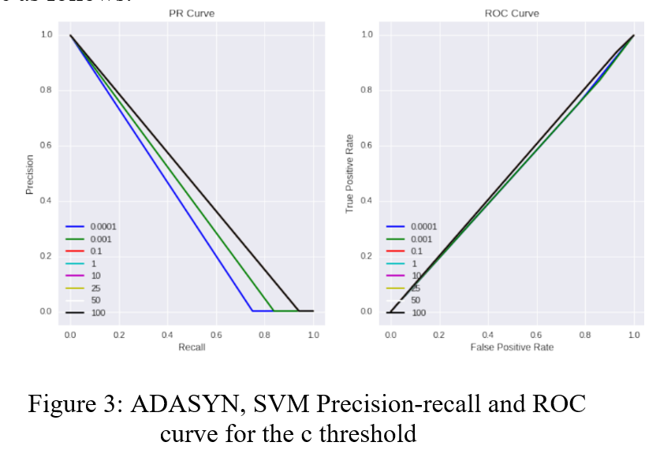
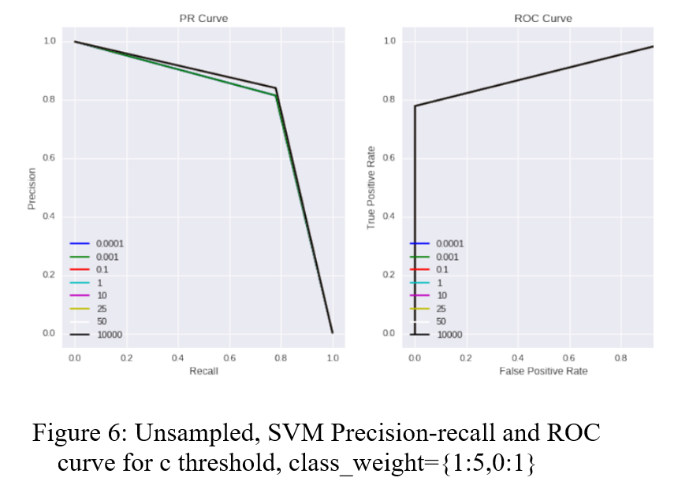

# Handling-Class-Imbalance-In-Credit-Card-Fraud-Detection
In this project, two days of European credit card transactions are used to test current state-of-the-art strategies for dealing with class imbalance at the data and algorithm levels. The obtained results are compared to a benchmark for three algorithms that have previously been shown to perform well in fraud detection research: random forest, multi-layer perceptron, and linear support vector machine.

## The dataset used contains transactions made by credit cards in September 2013 by European cardholders.
This dataset presents transactions that occurred in two days, where we have 492 frauds out of 284,807 transactions. The dataset is highly unbalanced, the positive class (frauds) account for 0.172% of all transactions.

## Dataset can be downloaded from https://www.kaggle.com/mlg-ulb/creditcardfraud

## Usage

a) Read the Paper (PDF): 

b) Run the Jupyter Notebook:

1. First download the dataset:

2. Generate a balanced dataset using ADASYN resampling (this will take several minutes):

`$ python adasyn.py`

3. Run the notebook:

`$ jupyter notebook`

</img>
</img>
</img>
</img>
</img>
</img>
</img>
</img>
